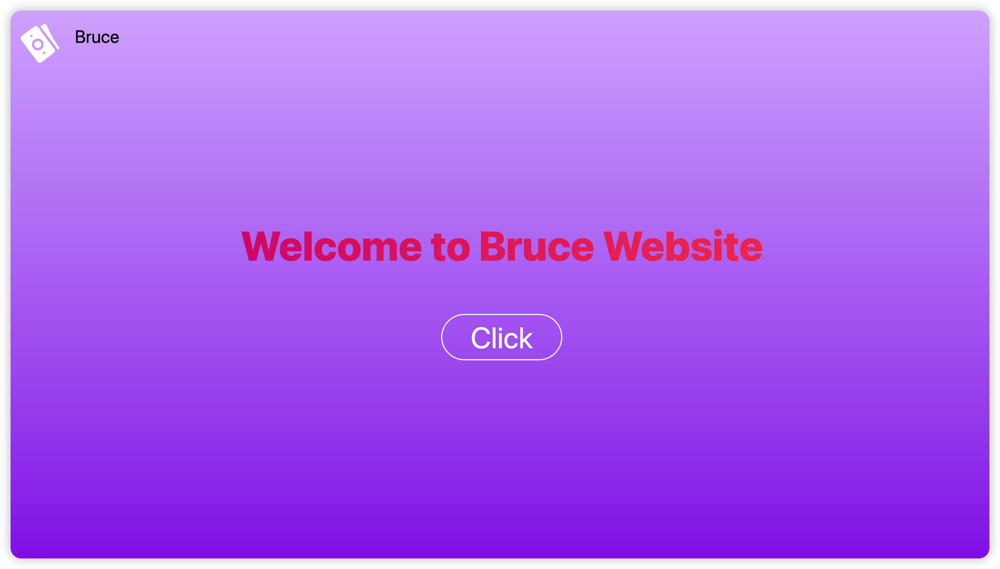

<!--
 * @Date: 2023-07-12 08:59:47
 * @Author: Bruce Hsu
 * @Description: 
-->
## React + Tailwindcss + Framer-motion

### Getting Started

```
pnpm run dev
```

Open http://localhost:5173 with your browser to see the result.



### Learn More

To learn more.take a look at the following resources:
   
- [Framer-motion](https://www.framer.com/motion/) - learn about Framer and 3D animate
- [Learn ReactJs](https://zh-hans.react.dev/) - learn about the grammer 
- [Tailwindcss](https://tailwindcss.com/) - Rapidly build modern websites without ever leaving your HTML.
